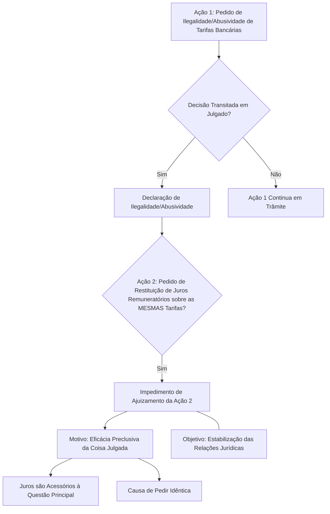

O Tema 1268, do STJ, define se a declaração de ilegalidade ou abusividade de tarifas e encargos em demanda anterior impede, sob a ótica da coisa julgada, o ajuizamento de nova demanda para requerer a repetição de juros remuneratórios não pleiteados na ação precedente.

### **Pontos Chave e Implicações**

| **Aspecto**                    | **Descrição**                                                                                                                                                                                                                                                   |
| :----------------------------- | :-------------------------------------------------------------------------------------------------------------------------------------------------------------------------------------------------------------------------------------------------------------- |
| **Princípio Central**          | **Eficácia Preclusiva da Coisa Julgada:** Abrange alegações e defesas que a parte poderia ter levantado na ação anterior, mas não o fez.                                                                                                                        |
| **Causa de Pedir**             | **Identidade:** A causa de pedir é idêntica em ambas as ações (a primeira sobre ilegalidade/abusividade de tarifas e encargos e a segunda sobre juros remuneratórios sobre elas), pois decorrem do mesmo contrato e das mesmas cláusulas.                       |
| **Natureza dos Juros**         | **Acessórios:** Os juros remuneratórios são considerados acessórios à pretensão principal (ilegalidade/abusividade das tarifas). A decisão definitiva sobre o principal estende-se ao acessório pelo princípio da gravitação jurídica.                          |
| **Impacto Prático**            | Impede que, após uma decisão definitiva sobre a ilegalidade ou abusividade de tarifas, uma nova ação seja proposta apenas para pleitear a restituição dos juros remuneratórios sobre essas mesmas tarifas, se essa restituição não foi pedida na ação original. |
| **Objetivo da Jurisprudência** | **Estabilização das Relações Jurídicas:** Garante definitividade às decisões judiciais, evitando a propositura de múltiplas ações sobre o mesmo fato e promovendo a segurança jurídica.                                                                         |
| **Legislação Relacionada**     | **Código de Processo Civil (CPC), art. 491** (que trata dos limites da coisa julgada).                                                                                                                                                                          |
| **Precedente Qualificado**     | **Tema 887/STJ** (mencionado como precedente que pode ter relação, embora o informativo não detalhe a conexão direta com o Tema 1268, serve como um "saiba mais" para aprofundamento em temas correlatos de precedentes qualificados).                          |
| **Casos Anteriores**           | **REsp 2.145.391-PB, REsp 2.148.576-PB, REsp 2.148.588-PB, REsp 2.148.794-PB** (todos da Segunda Seção, com Relatoria do Ministro Antonio Carlos Ferreira, julgados em 10/9/2025). Esses recursos foram os que formaram o precedente vinculante do Tema 1268.   |
| **Exceção (anteriormente)**    | A Terceira Turma (no REsp 2.000.231/PB) chegou a ter um entendimento oposto, permitindo a cobrança posterior, mas essa divergência foi pacificada pela Segunda Seção no sentido do impedimento, conforme a tese fixada.                                         |

### **Diagrama da Decisão**

### **Cenário Ilustrativo**

Imagine que um consumidor moveu uma ação contra um banco para declarar a ilegalidade de uma "tarifa de avaliação" cobrada em seu financiamento. A justiça deu ganho de causa, reconhecendo a ilegalidade da tarifa e condenando o banco a restituir o valor pago por ela. No entanto, o consumidor não pediu na primeira ação a restituição dos _juros remuneratórios_ que incidiram sobre essa tarifa ilegal ao longo do tempo.

Com base no Tema Repetitivo 1268/STJ, esse consumidor **não poderá ajuizar uma nova ação** pleiteando apenas a restituição desses juros remuneratórios. A coisa julgada da primeira ação, que já declarou a ilegalidade da tarifa, "preclui" a possibilidade de discutir separadamente os juros que dela decorrem, pois a questão dos juros estava implícita na discussão da ilegalidade da tarifa.

### **Recomendações**

- **Para Advogados:** É crucial que, ao ajuizar ações questionando tarifas e encargos bancários, **todos os pedidos decorrentes** (como a restituição dos juros remuneratórios incidentes sobre essas tarifas) sejam feitos na **mesma demanda inicial**. Isso evita a preclusão e a impossibilidade de pleitear tais valores em ações futuras.
- **Para Consumidores:** Busque sempre a orientação de um profissional do direito para garantir que todos os seus direitos sejam pleiteados de forma completa em uma única ação, caso precise questionar tarifas bancárias.